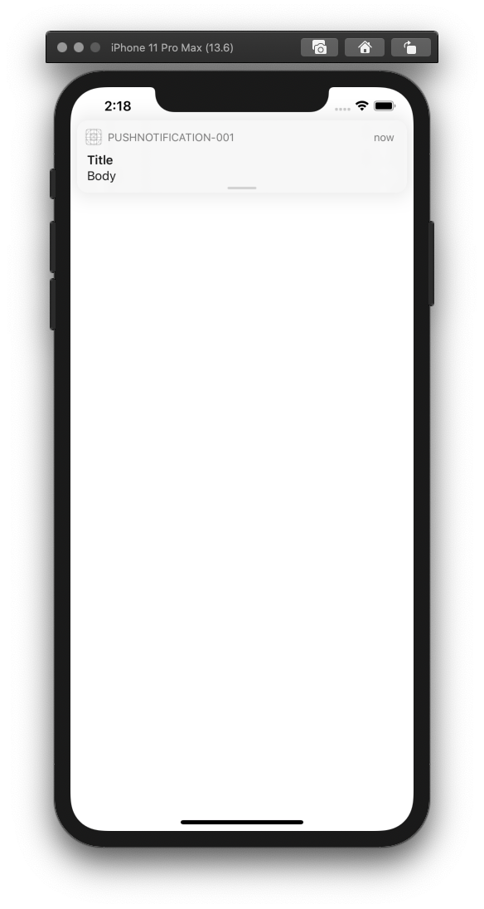
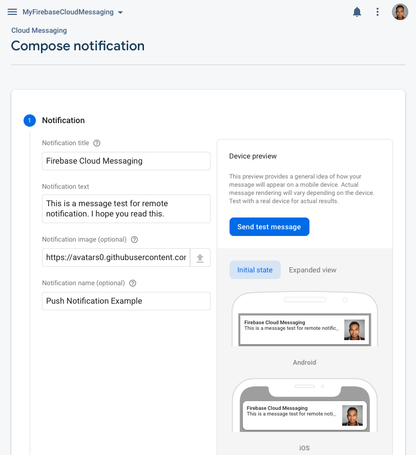
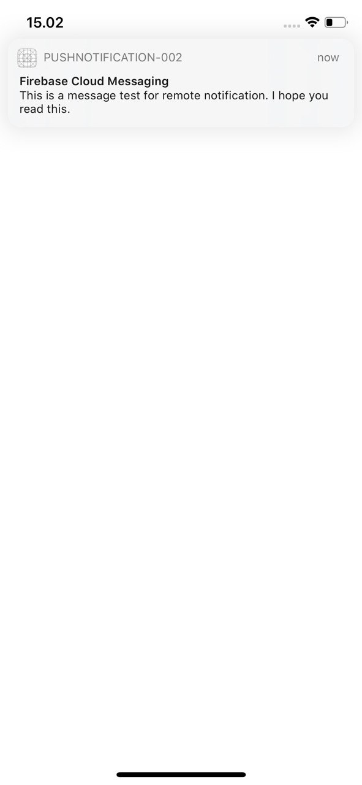

# ios-learn-push-notification

### 1. (5 Easy Steps) Send Local Notifications in iOS
Learn how to create a local notification. 
* You can check the full tutorial [here](https://www.youtube.com/watch?v=JuqQUP0pnZY). 
&nbsp;

### 2. Remote Push Notification with Firebase
Learn how to create a remote notification with Firebase. 
&nbsp;
&nbsp;
